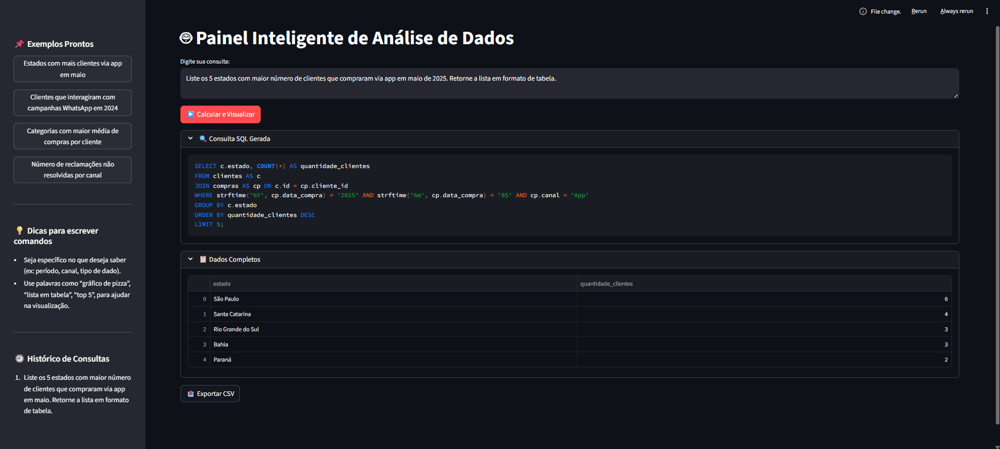
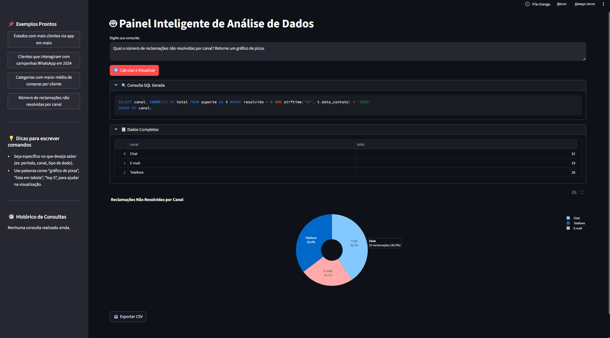
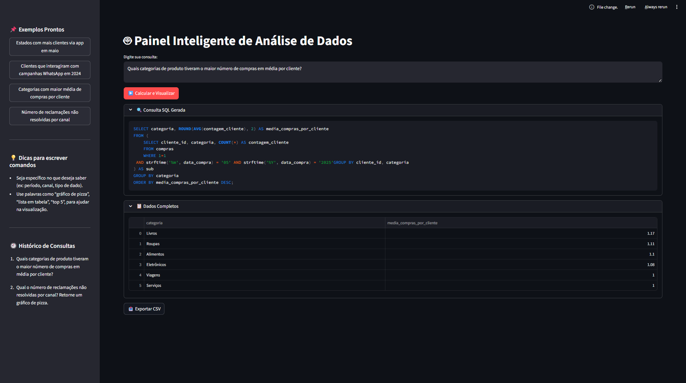

# README - Painel Inteligente de Análise de Dados com IA

## Instruções de Execução

1. **Pré-requisitos**  
    - Python 3.8 ou superior  
    - Instalar dependências:  
     ```bash
     pip install -r requirements.txt
     ```

2. **Servidor Ollama**  
   Certifique-se que o servidor Ollama está rodando localmente na porta configurada (default: 11435):  
   ```bash
   ollama serve
   ```

3. **Banco de Dados**  
   Verifique se o arquivo do banco SQLite está disponível no caminho configurado em `config.py`.

4. **Executar a aplicação**  
   ```bash
   streamlit run app.py
   ```

5. **Uso**  
   - Insira consultas em linguagem natural na área de texto principal.  
   - Use os exemplos no sidebar para testar rapidamente.  
   - Visualize resultados em tabelas, métricas ou gráficos gerados automaticamente.
   - Exporte os resultados para um arquivo.csv ao selecionar "Exportar CSV"

---

## Explicação do Fluxo de Agentes

O sistema é organizado em três agentes principais:

- **Agente 1 – Interpretação de Linguagem Natural**  
  Recebe o comando do usuário em texto livre e usa um modelo LLM local para transformar em query SQL estruturada. Também identifica o tipo de visualização (ex: pizza, barras).

- **Agente 2 – Consultor de Dados**  
  Executa a query no banco SQLite, trata e prepara os dados retornados (DataFrame) para análise e visualização.

- **Agente 3 – Formatação da Resposta**  
  Formata e apresenta os dados ao usuário, exibindo tabelas, métricas ou gráficos interativos via Streamlit e Plotly.

---

## Exemplos de Consultas Testadas

- "Liste os 5 estados com maior número de clientes que compraram via app em maio de 2025. Retorne a lista em formato de tabela."
- "Liste as top 5 campanhas de marketing que mais geraram vendas em 2025, retornando o nome da campanha e o valor total vendido, ordenados do maior para o menor valor."
- "Quantos clientes interagiram com campanhas de WhatsApp em 2024?"
- "Mostre a lista de clientes distintos que interagiram com campanhas no WhatsApp em 2024, em formato de tabela"
- "Liste os 5 clientes com mais interações em campanhas de WhatsApp em 2024, em formato de tabela."
- "Quais categorias de produto tiveram o maior número de compras em média por cliente?"
- "Qual o número de reclamações não resolvidas por canal? Retorne um gráfico de pizza."
- "Quais cidades têm clientes com maior frequência de compras?"
- "Mostre a quantidade total de atendimentos por tipo de contato, ordenados do mais frequente para o menos frequente, em formato de tabela."

---

## Exemplo de Uso







---

## Insights Extraídos dos Dados

- A região Sul e a região Sudeste registraram o maior número de clientes que compraram via aplicativo em maio de 2025. São Paulo lidera com 6 clientes, seguido por Santa Catarina, com 4. Em terceiro lugar Rio Grande do Sul e Paraná, ambos com 3 e em quarto lugar Paraná com 2.
- Os dados indicam que as campanhas que mais geraram receita até agora são lideradas pelo "Lançamento de Produto", com um valor total de R$ 240.837,08. Em seguida, a campanha "Liquidação de Verão" alcançou R$ 205.059,72, seguida por "Black Friday" com R$ 189.439,48. As campanhas de "Natal" e "Volta às Aulas" também apresentaram bons resultados, com receitas de R$ 181.780,64 e R$ 154.700,33, respectivamente. Esses números mostram que as campanhas sazonais e de lançamentos concentram a maior parte das vendas, indicando pontos fortes para focar estratégias futuras.
- O número de clientes que interagiram com campanhas de WhatsApp foi 34.
- As categorias de produtos que tiveram o maior número médio de compras por cliente são, em ordem decrescente: Serviços, com uma média de 2,15 compras por cliente; Livros, com 2,13; Roupas, com 2,12; Eletrônicos, com 1,99; Viagens, com 1,93; e Alimentos, com 1,91. Isso indica que os clientes compram com maior frequência produtos da categoria Serviços, seguidos de Livros e Roupas.
- Os dados mostram que a maior parte das reclamações não resolvidas em 2025 ocorre pelo canal de Chat, representando 40,2% do total, seguido pelo canal Telefone com 35,4% e pelo E-mail com 24,1%. Isso indica que, apesar do Chat ser o canal com maior volume de reclamações não resolvidas, o Telefone também apresenta uma quantidade significativa, enquanto o E-mail possui o menor percentual entre os três canais analisados. Esses insights podem direcionar ações focadas na melhoria do atendimento principalmente nos canais de Chat e Telefone para reduzir o número de reclamações não resolvidas.
- Belém, Santos e Teresina são as cidades com clientes que mais compraram. Isso indica que essas regiões têm maior fidelidade ou resposta a promoções. Surpreende não ver São Paulo ou Rio no top 10 pode significar que nessas grandes cidades os clientes estão mais dispersos entre concorrentes.
- A análise revela que "Dúvidas" representam o tipo de contato mais frequente entre os casos resolvidos (56 atendimentos), seguido por "Reclamações" (46) e "Agendamentos" (41), sugerindo que a equipe de suporte tem maior eficiência no atendimento de demandas informativas em comparação com outros tipos de solicitações.
---

## Sugestões de Melhorias e Extensões do Projeto

1. **Automatização da Extração do Schema do Banco de Dados**  
   - Implementar uma função que extraia dinamicamente a estrutura das tabelas diretamente do banco SQLite, evitando manutenção manual no prompt e garantindo atualização automática frente a alterações no schema.
2. **Melhoria na Geração de Queries SQL com LangChain**  
   - Integrar LangChain para geração mais precisa e correta de queries, respeitando o dialeto SQLite e usando modelos avançados (ex: GPT-4).  
   - Tratar casos de erros comuns na geração, como o uso de cláusulas não suportadas.
3. **Orquestração Avançada com CrewAI**  
   - Estruturar o sistema com múltiplos agentes especializados:  
     - Agente de Interpretação (conversão de linguagem natural para SQL)  
     - Agente de Execução (execução e validação das queries)  
     - Agente de Visualização (formatação e apresentação dos resultados)  
   - Isso permite modularidade, maior robustez e facilidade de manutenção.
4. **Validação Avançada das Queries e Resultados**  
   - Implementar mecanismos para detectar problemas nos dados retornados, como taxas de resolução zeradas, resultados vazios ou inconsistências, sinalizando essas situações para o usuário.
5. **Correção Automática de Queries Problemáticas**  
   - Criar funções para identificar e corrigir padrões comuns de erro em queries geradas automaticamente, como substituir cláusulas inválidas ou nomes incorretos de colunas.
6. **Cache de Consultas Frequentes**  
   - Implementar caching para acelerar respostas de consultas recorrentes, reduzindo carga no banco e melhorando a experiência do usuário.
7. **Feedback e Aprendizado Contínuo**  
   - Adicionar um sistema onde o usuário possa indicar se a resposta foi útil, alimentando um ciclo de melhoria contínua do modelo.

---

=======
# smart-data-agent
Sistema com orquestração simples de agentes de IA que interpreta comandos em linguagem natural, converte-os em SQL para um banco SQLite e apresenta insights e gráficos. Inclui agentes de interpretação, consulta e formatação, usando Ollama como LLM local e Python para integração e execução.
>>>>>>> 644130e72556ee80f46864303fc070fe11c32311
